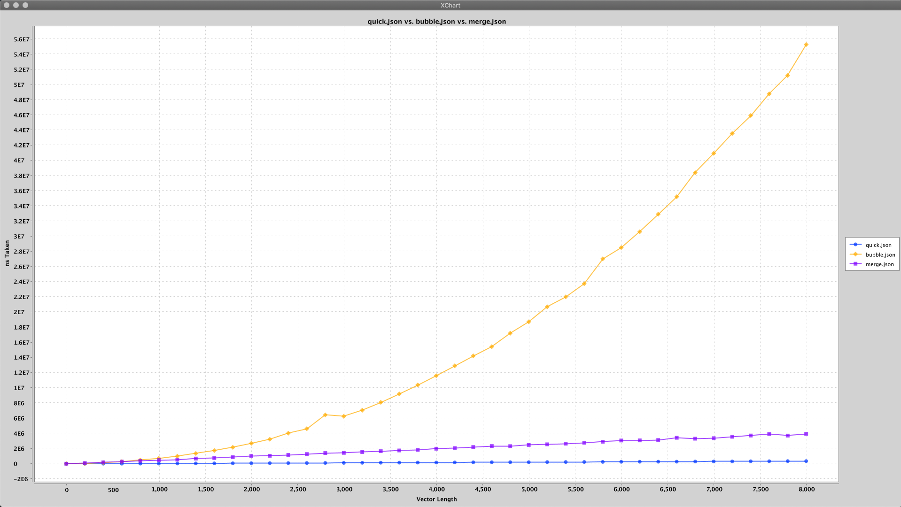

# bubblesort vs quicksort benchmarker
I did this as a kata of sorts - to get in the zone with TDD techniques and using tools. I also have been learning Java and wanted to use it for something. 



## Prerequisites
* maven
* java 8
* c++11
* cmake
* conan

## Build and run bubblesort benchmark
```bash
mkdir build && cd build
conan install ..
cmake ..
make test
make graph
```
